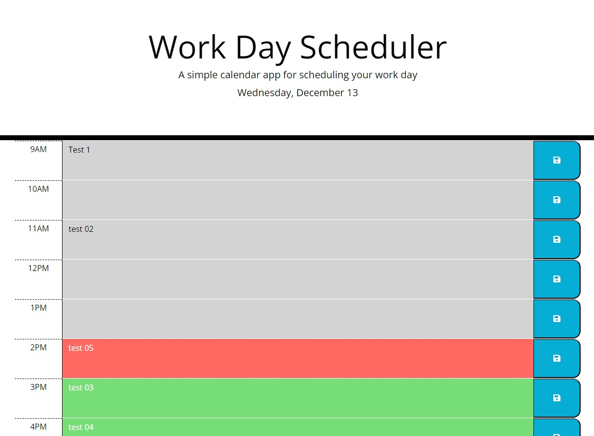

# K88KPlanner
# Module 7 Challenge: Schedule Planner

# Expected Result
The following animation demonstrates the application functionality:

## Requirements

The app should:

* Display the current day at the top of the calender when a user opens the planner.
 
* Present timeblocks for standard business hours when the user scrolls down.
 
* Color-code each timeblock based on past, present, and future when the timeblock is viewed.
 
* Allow a user to enter an event when they click a timeblock

* Save the event in local storage when the save button is clicked in that timeblock.

* Persist events between refreshes of a page

## My Work

GitHub link: [K88KPlanner](https://github.com/KyloGG88/K88KPlanner)

GitPages link: [K88KPlanner](https://kylogg88.github.io/K88KPlanner/)

Here are screenshots of my work: (screenshots must be updated)

* Schedule Planner layout

* Save Button records data      

* Data saved to Local Storage

# Resources

***Days Js***
*     https://day.js.org/docs/en/display/format
***Zet Code***
*     https://zetcode.com/javascript/dayjs/
***MDN Web Docs***
*     https://developer.mozilla.org/en-US/docs/Web/API/Storage/getItem
***CodingNinjas***
*     https://www.codingninjas.com/studio/library/settimeout-jquery
***Log Rocket***
*     https://blog.logrocket.com/storing-retrieving-javascript-objects-localstorage/
***Stack Overflow***
*       https://stackoverflow.com/questions/74433492/how-can-i-display-the-date-and-time-in-dayjs-12hours-clock-using-dayjs
*       https://stackoverflow.com/questions/26887393/how-to-do-time-check-in-jquery
*       https://stackoverflow.com/questions/67700374/use-localstorage-getitem-with-typescript
*       https://stackoverflow.com/questions/1962861/javascript-alert-box-with-timer
*       https://stackoverflow.com/questions/16086201/jquery-changing-style-of-html-element

# License

Public - MIT License